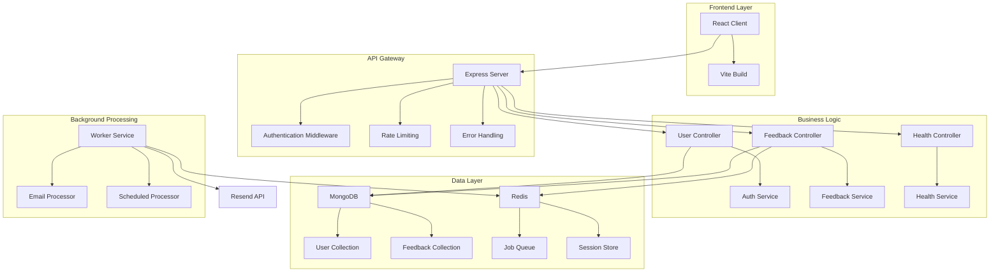

# EchoBoard - Feedback Management System

<div align="center">


**A modern, real-time feedback management platform built with React, Node.js, and microservices architecture.**

[](https://www.typescriptlang.org/)
[](https://reactjs.org/)
[](https://nodejs.org/)
[](https://www.mongodb.com/)
[](https://redis.io/)
[](https://www.docker.com/)
[](https://kubernetes.io/)

[Live Demo](https://echoboard.dev) • [Documentation](#documentation) • [API Reference](#api-endpoints) • [Contributing](#contributing)

</div>

## 📋 Table of Contents

- [Overview](#overview)
- [Features](#features)
- [Architecture](#architecture)
- [Tech Stack](#tech-stack)
- [Getting Started](#getting-started)
- [API Documentation](#api-documentation)
- [Deployment](#deployment)
- [Contributing](#contributing)
- [License](#license)

## 🎯 Overview

EchoBoard is a comprehensive feedback management system designed to streamline the collection, processing, and analysis of user feedback. Built with modern web technologies and microservices architecture, it provides a scalable solution for organizations to gather insights and improve their products or services.

### Key Capabilities

- **Real-time Feedback Collection** - Users can submit feedback with ratings and categories
- **Admin Dashboard** - Comprehensive management interface for administrators
- **Role-based Access Control** - Secure user and admin authentication
- **Email Notifications** - Automated email system for feedback updates
- **System Health Monitoring** - Real-time monitoring of service status
- **Mobile Responsive** - Optimized for all device sizes

## ✨ Features

### 🔐 Authentication & Authorization
- **JWT-based Authentication** - Secure session management
- **Role-based Access Control** - Separate interfaces for users and admins
- **Session Persistence** - Maintains login state across browser sessions
- **Protected Routes** - Automatic redirection based on user roles

### 📊 User Dashboard
- **Feedback Submission** - Easy-to-use form with rating system
- **Personal Feedback History** - View all submitted feedback
- **Real-time Statistics** - Track feedback metrics and ratings
- **Status Tracking** - Monitor feedback approval status

### 🛠️ Admin Dashboard
- **Feedback Management** - Approve, reject, or modify feedback
- **System Health Monitoring** - Real-time service status
- **Analytics & Insights** - Comprehensive feedback analytics
- **User Management** - Monitor user activity and feedback

### 📧 Email System
- **Welcome Emails** - Automated user onboarding
- **Feedback Notifications** - Status update notifications
- **Scheduled Reminders** - Automated follow-up system
- **Resend Integration** - Reliable email delivery

### 🏗️ System Architecture
- **Microservices Design** - Scalable and maintainable architecture
- **Queue-based Processing** - Asynchronous job processing
- **Health Monitoring** - Comprehensive system health checks
- **Containerized Deployment** - Docker and Kubernetes ready

## 🏛️ Architecture



## 🛠️ Tech Stack

### Frontend (`client/`)
- **Framework**: React 18 with TypeScript
- **Build Tool**: Vite
- **Styling**: Tailwind CSS with custom design system
- **UI Components**: Radix UI primitives
- **State Management**: React Hooks + Context
- **Routing**: React Router v6
- **HTTP Client**: Axios
- **Icons**: Lucide React

### Backend (`server/`)
- **Runtime**: Node.js 18+
- **Framework**: Express.js
- **Language**: TypeScript
- **Database**: MongoDB with Mongoose ODM
- **Authentication**: JWT with express-session
- **Validation**: Custom middleware
- **Logging**: Pino logger
- **Rate Limiting**: express-rate-limit
- **CORS**: Express CORS middleware

### Worker (`worker/`)
- **Job Queue**: BullMQ
- **Message Broker**: Redis
- **Email Service**: Resend API
- **Scheduling**: BullMQ cron jobs
- **Language**: TypeScript

### Infrastructure
- **Containerization**: Docker
- **Orchestration**: Kubernetes
- **Database**: MongoDB
- **Cache/Queue**: Redis
- **Ingress**: NGINX
- **CI/CD**: GitHub Actions

## 🚀 Getting Started

### Prerequisites

- **Node.js** (v18 or higher)
- **npm** (v8 or higher)
- **Docker** and **Docker Compose**
- **MongoDB** (local or cloud)
- **Redis** (local or cloud)

### Installation

1. **Clone the repository:**
   ```bash
   git clone https://github.com/your-username/echoboard.git
   cd echoboard
   ```

2. **Install dependencies:**
   ```bash
   # Install root dependencies
   npm install
   
   # Install client dependencies
   cd client && npm install && cd ..
   
   # Install server dependencies
   cd server && npm install && cd ..
   
   # Install worker dependencies
   cd worker && npm install && cd ..
   ```

3. **Environment Configuration:**
   ```bash
   # Copy environment template
   cp server/.env.example server/.env
   cp worker/.env.example worker/.env
   ```

4. **Configure Environment Variables:**
   
   **Server (.env):**
   ```env
   NODE_ENV=development
   PORT=3000
   JWT_SECRET=your-super-secret-jwt-key
   MONGO_URI=mongodb://localhost:27017/echoboard
   REDIS_HOST=localhost
   REDIS_PORT=6379
   REDIS_PASSWORD=
   SESSION_SECRET=your-session-secret
   ```

   **Worker (.env):**
   ```env
   NODE_ENV=development
   REDIS_HOST=localhost
   REDIS_PORT=6379
   REDIS_PASSWORD=
   RESEND_API_KEY=your-resend-api-key
   FROM_EMAIL=EchoBoard <noreply@yourdomain.com>
   ```

### Development

#### Option 1: Docker Compose (Recommended)
```bash
# Start all services
docker-compose up -d

# View logs
docker-compose logs -f

# Stop services
docker-compose down
```

#### Option 2: Local Development
```bash
# Terminal 1: Start MongoDB and Redis
# (Install and start MongoDB and Redis locally)

# Terminal 2: Start Server
cd server
npm run dev

# Terminal 3: Start Worker
cd worker
npm run dev

# Terminal 4: Start Client
cd client
npm run dev
```

### Building for Production

```bash
# Build all components
npm run build:all

# Or build individually
npm run build:client
npm run build:server
npm run build:worker
```

## 📚 API Documentation

### Base URL
- **Development**: `http://localhost:3000`
- **Production**: `https://echoboard.dev`

### Authentication Endpoints

| Method | Endpoint | Description | Auth Required |
|--------|----------|-------------|---------------|
| `POST` | `/api/users/signup` | User registration | No |
| `POST` | `/api/users/signin` | User login | No |
| `POST` | `/api/users/signout` | User logout | Yes |
| `GET` | `/api/users/currentuser` | Get current user | Yes |

### Feedback Endpoints

| Method | Endpoint | Description | Auth Required | Role |
|--------|----------|-------------|---------------|------|
| `POST` | `/api/feedback` | Create feedback | Yes | User |
| `GET` | `/api/feedback` | List all feedback | Yes | Admin |
| `GET` | `/api/feedback/:id` | Get specific feedback | Yes | User/Admin |
| `PUT` | `/api/feedback/:id` | Update feedback | Yes | Admin |
| `DELETE` | `/api/feedback/:id` | Delete feedback | Yes | Admin |

### System Endpoints

| Method | Endpoint | Description | Auth Required |
|--------|----------|-------------|---------------|
| `GET` | `/api/health` | System health status | No |

### Request/Response Examples

#### User Registration
```bash
curl -X POST http://localhost:3000/api/users/signup \
  -H "Content-Type: application/json" \
  -d '{
    "name": "John Doe",
    "email": "john@example.com",
    "password": "securepassword"
  }'
```

#### Create Feedback
```bash
curl -X POST http://localhost:3000/api/feedback \
  -H "Content-Type: application/json" \
  -H "Authorization: Bearer <jwt-token>" \
  -d '{
    "title": "Great feature request",
    "content": "I would love to see dark mode support",
    "rating": 5,
    "category": "feature"
  }'
```

## 🚀 Deployment

### Kubernetes Deployment

The application is designed for Kubernetes deployment with the following components:

- **Client Deployment**: React frontend on port 8080
- **Server Deployment**: Express API on port 3000
- **Worker Deployment**: Background job processor
- **MongoDB**: Database service
- **Redis**: Cache and message broker
- **Ingress**: NGINX ingress controller

### Production Environment

- **URL**: https://echoboard.dev
- **Health Check**: https://echoboard.dev/api/health
- **Status**: [](https://echoboard.dev)

### Deployment Commands

```bash
# Deploy to Kubernetes
kubectl apply -f infra/k8s/

# Check deployment status
kubectl get pods

# View logs
kubectl logs -f deployment/server-depl
kubectl logs -f deployment/worker-depl
```

## 🧪 Testing

```bash
# Run client tests
cd client && npm test

# Run server tests
cd server && npm test

# Run worker tests
cd worker && npm test

# Run all tests
npm run test:all
```

## 📊 Monitoring

### Health Checks
- **API Health**: `/api/health`
- **Database Connectivity**: MongoDB connection status
- **Redis Status**: Queue and cache health
- **Email Service**: Resend API connectivity

### Metrics
- Response times
- Error rates
- Queue processing times
- Database performance

## 🤝 Contributing

We welcome contributions! Please follow these steps:

1. **Fork the repository**
2. **Create a feature branch**: `git checkout -b feature/amazing-feature`
3. **Commit changes**: `git commit -m 'Add amazing feature'`
4. **Push to branch**: `git push origin feature/amazing-feature`
5. **Open a Pull Request**

### Development Guidelines

- Follow TypeScript best practices
- Write comprehensive tests
- Update documentation
- Follow the existing code style
- Ensure all checks pass

## 📄 License

This project is licensed under the MIT License - see the [LICENSE](LICENSE) file for details.

## 🙏 Acknowledgments

- [React](https://reactjs.org/) - Frontend framework
- [Express.js](https://expressjs.com/) - Backend framework
- [MongoDB](https://www.mongodb.com/) - Database
- [Redis](https://redis.io/) - Cache and message broker
- [Tailwind CSS](https://tailwindcss.com/) - Styling framework
- [Radix UI](https://www.radix-ui.com/) - UI components

## 📞 Support

- **Documentation**: [Wiki](https://github.com/your-username/echoboard/wiki)
- **Issues**: [GitHub Issues](https://github.com/your-username/echoboard/issues)
- **Discussions**: [GitHub Discussions](https://github.com/your-username/echoboard/discussions)
- **Email**: support@echoboard.dev

---

<div align="center">

**Built with ❤️ by the EchoBoard Team**

[](https://github.com/your-username/echoboard)
[](https://linkedin.com/company/echoboard)

</div>